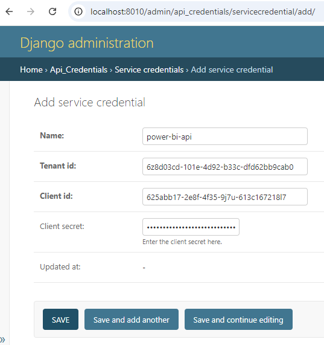
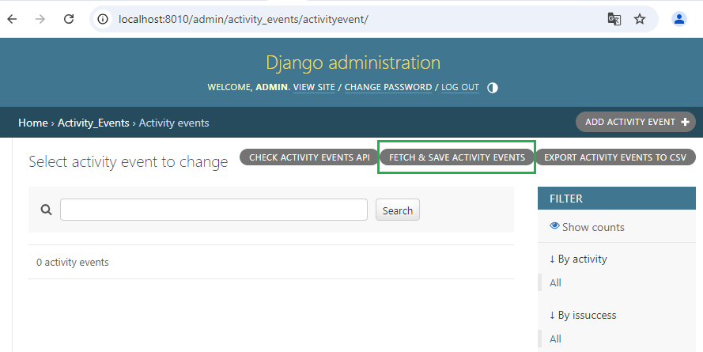
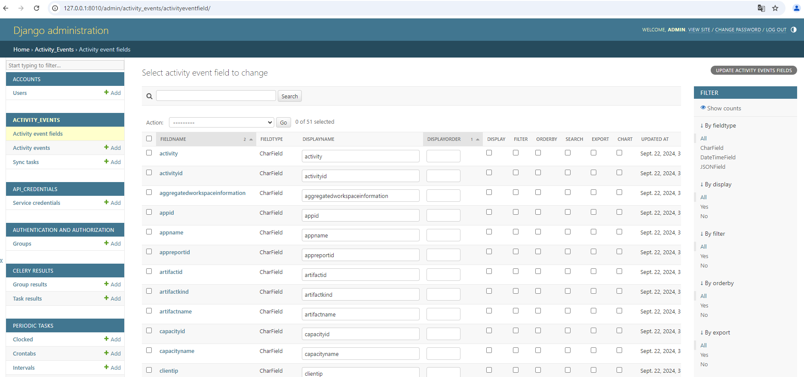
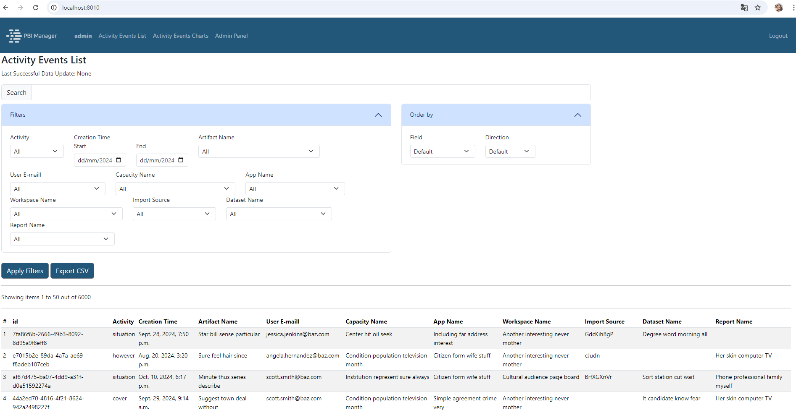
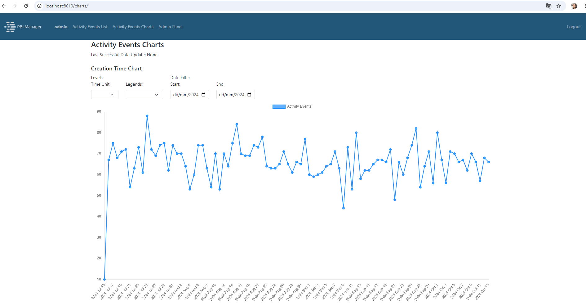

# 1. Introduction
This management platform focuses on collecting Power BI activity events data through the Power BI REST API and storing it in a database to enhance organizational monitoring and management capabilities. The application captures, stores, displays and exports user activity events, such as report views, dashboard interactions, and data usage within Power BI. It features a custom REST API that simplifies querying this data compared to the Microsoft Power BI REST API, facilitating integration and enabling the creation of datasets and reports over extended periods. Additionally, the application supports CSV export functionality, allowing users to analyze data with various programs and AI models, including ChatGPT. Built with Python and Django, it seamlessly integrates Power BI activity events data from Microsoft's API and stores it in a relational database, all presented through a user-friendly interface styled with Bootstrap. Users can export historical activity data in CSV format and access an interactive dashboard powered by Chart.js, providing visual insights into aggregated user activity. Asynchronous tasks are managed by Celery, with updates scheduled by Celery Beat, while Redis functions as the task broker overseeing background processes. The integration of these technologies, especially the connection with Microsoft Power BI Activity Events Data through the API and the use of Celery and Redis for asynchronous task management, not only adds distinctiveness to the application but also facilitates future developments that will further optimize administrative operations in Power BI.

# 2. Distinctiveness and Complexity
This web application distinguishes itself through its specialized focus on managing and analyzing Power BI activity events data, directly addressing the organizational need to monitor, track, and export user activity within a business intelligence environment. Unlike typical course projects such as social networks or e-commerce platforms, which primarily emphasize user interactions or product transactions, this application enables organizations to interpret Power BI activity data. This functionality empowers organizations to make informed decisions regarding license usage and resource allocation, effectively addressing real-world administrative needs. By providing insights into Power BI activity data, the application enhances operational efficiency and resource management, ensuring that organizations can optimize their business intelligence investments.

The application serves as an advanced solution for managing and analyzing Power BI activity events data. Several key aspects contribute to its complexity, reflecting a deliberate integration of technologies and design principles. The following sections outline these critical elements, emphasizing their role in enhancing the project's overall functionality and utility.

**Integration with Power BI**

A key aspect of this application lies in its seamless integration with Power BI through the straightforward configuration of a service principal. Administrators can efficiently set up the necessary credentials—Tenant ID, Client ID, and Client Secret—directly within the admin interface, streamlining the integration process with Power BI’s API. To enhance security, the Client Secret is encrypted before being stored in the database. Furthermore, administrators have the option to utilize environment variables, providing an alternative to database storage when security concerns arise. This added flexibility not only bolsters security but also demonstrates the application's sophisticated approach to user configuration and resource management.

**Asynchronous Task Management with Celery**

The integration of Celery for asynchronous task management enhances the project's architecture. Resource-intensive operations, such as fetching Power BI activity events and generating CSV reports, run in the background, minimizing their impact on system performance. Celery Beat schedules these tasks at regular intervals, automating data retrieval from the API, while Redis facilitates communication between Django and Celery. This approach fosters an autonomous system within the Django ecosystem by automating routine tasks, such as purging records older than a specified date, thereby improving database performance and reducing the need for manual intervention.

**Handling of Activity Event Attributes**

The application processes over 100 potential activity event attributes from the API, adding a significant layer of complexity. More than 50 of these attributes are mapped to individual fields in the database, while the remainder are stored in a flexible JSON field (extra_data). This structure allows the system to adapt to varying event formats and supports future scalability. Additionally, presenting this information on an HTML page poses a challenge due to the large volume of data and the potential variability in what organizations consider relevant. To address this, the Django Admin interface allows administrators to configure display names, define searchable and filterable fields, and customize chart configurations for the pages. These customization options enhance the system's adaptability beyond standard templates or static data structures, ensuring it effectively meets the diverse needs of various organizations.

**Custom REST API Development**

The custom REST API, built using Django REST Framework, overcomes the limitations of Microsoft's native Power BI API, which restricts data access to the past 30 days and limits retrieval to one day per request. This application’s API enables querying data over multiple days in a single request, significantly reducing the number of API calls and bypassing restrictive rate limits. Paginated results ensure efficient handling of large datasets. Additionally, by periodically storing Power BI activity data retrieved through the API, administrators can define custom retention policies within the application, allowing queries of historical data over extended periods.

**CSV Export Functionality**

The CSV export functionality adds versatility by offering a universally recognized format for exporting Power BI activity data. CSV files are compatible with many programs, including AI tools and spreadsheets, providing organizations the ability to leverage external applications or AI models for deeper analysis. This broadens the application’s practical use, particularly for data-driven decision-making.

**Data Visualization with Chart.js**

To enhance user experience, the project leverages Chart.js, a JavaScript library not covered in the course, for visualizations of aggregated Power BI activity data. These charts dynamically update as new data is retrieved and processed, introducing more advanced front-end complexity and allowing administrators to interpret large datasets more effectively through graphical representations.

**Synchronous Operations via Django Admin**

Operations such as fetching activity events, testing API connections, and exporting reports can be performed synchronously through the Django Admin interface. These tasks provide immediate feedback, simplifying the workflow for administrators and improving overall efficiency by enabling real-time execution.

**Dockerization for Development**

The project uses Dockerization to improve the development environment, utilizing a Docker Compose file to manage key components like Redis, Celery workers, and PostgreSQL. This setup allows quick deployment with minimal configuration, ensuring consistent dependency availability. While the Docker configuration used does not fully meet production standards due to the absence of components like Nginx for serving static files and managing traffic, it represents an improvement over previous course projects that primarily relied on a Django application with an SQLite database.

In conclusion, this web application demonstrates technical proficiency by addressing the specific needs of Power BI administrators. Its integration with Power BI through a service principal, along with asynchronous task management, a custom REST API, CSV export capabilities, and data visualizations, reflects both complexity and practical applicability. The project extends beyond typical course assignments, offering a robust solution for managing and analyzing Power BI activity data.

# 3. Django project: Django apps and files description

The project is structured into three distinct Django apps, each serving a specific function:

- **`activity_events`**: This is the core application responsible for the primary functionality, including the collection, processing, and analysis of Power BI activity events data. It handles all event-related logic and is central to the project’s purpose.
  
- **`api_credentials`**: This app manages the integration with Microsoft’s API by securely handling service principal credentials. It facilitates the setup and storage of the Tenant ID, Client ID, and encrypted Client Secret required for API access. Administrators can configure and update these credentials directly within the admin interface.

- **`accounts`**: This app handles user authentication, enabling login and logout actions. Due to its focus on Power BI administrative tasks, user registration is managed by admin.

[View the project tree](docs/text/project_tree.txt) - This file contains the complete directory tree structure of the project, including files and folders.

Only the key files from each app will be described below.

## 3.1. `activity_events` App

**`admin.py`**: customizes the admin interface for managing `ActivityEventField`, `ActivityEvent`, and `SyncTask` objects in the Django application. The `ActivityEventFieldAdmin` class allows viewing and populating activity fields but prevents adding or deleting records. The `ActivityEventAdmin` class includes functionalities for checking and fetching activity events, as well as exporting them to CSV. Each class provides user feedback through messages indicating success or errors during operations.

**`app_settings.py`**: is a configuration module for a Django application. It utilizes Django's settings system to define various configuration parameters specific to the application. It retrieves values from the global Django settings and provides default values for parameters related to task names, fetch limits, pagination, and chart settings, among others.

**`common_functions.py`**: file contains utility functions that assist with managing and processing querysets in a Django application. It provides:

- Filtering and Search: Functions to apply filters and search criteria to querysets based on user inputs and model configurations.
- Sorting: Capability to sort querysets by specific fields and order directions.
- Task Management: A utility to find the most recent successful execution time of tasks, combining results from syncronous and assyncronous models.

These functions are designed to streamline data processing tasks and ensure consistency across different parts of the application.

**`fetch_activity_events_functions.py`**: defines a set of functions for managing activity events in a Django application. It includes functionality for fetching activity events from an external API, processing them, and saving the results to the database. Key operations include:

- Fetching data from an API with support for handling pagination and errors.
- Processing and saving activity events based on time ranges.
- Handling task synchronization and tracking the success or failure of data retrieval tasks.
- Removing old records from the database based on a specified retention period.

Overall, this module facilitates the integration and management of activity events data, ensuring efficient data handling and storage.

**`generate_csv_functions.py`**: provides functionality for creating and managing CSV files containing activity event data. It includes functions to:

- Generate CSV files based on filtered activity event data.
- Write the data to either an HTTP response or a file on disk.
- Manage old CSV files by deleting them based on a retention policy.

Overall, this file handles the export of activity event data, including filtering, file creation, and cleanup of outdated files.

**`generate_fake_data_functions.py`**: provides functionality for generating and managing fake data for activity events in a Django application. It includes functions to:

- Generate and save a specified number of fake activity event records, with customizable parameters for users, date ranges, and event types.
- Create various data types such as emails, user agents, UUIDs, and more using the Faker library.
- Generate random strings, phrases, and IPv4 addresses for diverse activity event simulation.
- Support the creation of random dictionaries for additional data attributes associated with events.

Overall, this file facilitates the simulation of activity event data for testing and development purposes.

**`populate_activity_fields_functions.py`**: file provides utilities for synchronizing and managing field information between a Django model and its corresponding database representation. It includes functions to:

- Verify Required Tables: Check if essential database tables exist.
- Synchronize Model Fields: Update or create entries in the `ActivityEventField` model based on the fields of the `ActivityEvent` model.
- Remove Obsolete Fields: Identify and delete field entries that are no longer present in the model.

These operations ensure that the field definitions in the application stay aligned with the actual database schema.

**`models.py`**: defines Django models for managing activity events and related fields in the database. It includes:

1. `ActivityEventField` Model: Represents metadata for fields in the `ActivityEvent` model, including attributes for filtering, sorting, searching, and exporting data. It also tracks display order and whether the field should be included in charts.

2. `SyncTask` Model: Tracks synchronization tasks with fields for task ID, name, status (pending, success, failure), result, and timestamps. It includes a custom save method to automatically generate a UUID if one is not provided.

3. `ActivityEvent` Model: captures detailed records of activity events with various fields for metadata, timestamps, and additional data. Includes methods for:
   - `get_fields_dict`: retrieves a dictionary of the model's field names and types.
   - `get_filtered_fields_dict`: filters field dictionary based on provided lists or dictionaries.
   - `create_or_update_from_dict`: creates or updates an activity event instance from a dictionary of data, with handling for field-specific transformations and validation.

Each model is configured with appropriate ordering and constraints to ensure data integrity and efficient querying.

**`task.py`**: defines several background tasks for managing activity events and related operations in the application. Using Celery, these tasks are executed asynchronously to handle various data processing and maintenance tasks efficiently.

Key tasks:

- Fetching and Updating Activity Events: processes and updates activity events, ensuring the latest data is captured and managed properly.
- Generating CSV Files: creates CSV files containing activity event data, facilitating data export and reporting.
- Cleaning Up Old Files and Records: handle the removal of outdated CSV files and old activity event records, helping to maintain system performance and manage storage efficiently.

These tasks help automate and streamline data management processes, making it easier to handle large volumes of activity event data.

**`views.py`**: contains the views for managing and interacting with activity event data in a Django web application. It provides functionality for displaying lists of activity events, generating and managing CSV exports, and creating charts based on activity event data.

Key views:

- `ActivityEventListView`: displays a paginated list of activity events, applying filters and ordering based on user input. It also provides context for filtering and sorting options and the latest data update time.

- `export_csv_vw`: initiates the generation of a CSV file containing activity event data. Returns a task ID to track the progress of the CSV generation.
- `check_csv_status_vw`: checks the status of the CSV generation task. If the task is complete, it provides a download URL for the generated CSV file.
- `download_csv_vw`: serves the generated CSV file for download based on the provided file name.
- `charts_vw`: prepares and returns data for creating charts based on activity event fields. It handles filtering, grouping, and aggregating data, and provides metadata about the fields and their values.
- `ActivityEventAPIListView`: an API view for listing activity events with filtering capabilities. It uses Django REST framework's `ListAPIView` to handle HTTP GET requests and return serialized data. requires basic authentication.

These views work together to enable users to interact with activity event data, including viewing, exporting, and analyzing it.

**`activity_events_filters.py`**: This file contains custom template filters designed to enhance the handling of query parameters within the Django application. It plays a crucial role in streamlining the process of retrieving, processing, and displaying filtered data from activity events.

Key functions:

- Attribute access: allows templates to dynamically access object attributes using the `get_attr` filter, enabling flexible data rendering.  
- Dictionary value retrieval: Simplifies retrieving values from dictionaries with `get_value`, ensuring templates can display data seamlessly.
- Item retrieval: provides the ability to retrieve specific elements from lists or tuples using the `index` filter, making it easier to display selected data points.
- Query parameter evaluation: The `has_non_empty_query_params` filter checks for the presence of non-empty parameters, facilitating conditional rendering based on user inputs.
- Query string generation: functions like `build_query_string_for_admin_activity_events` and `build_query_string` generate URL query strings from request parameters, essential for pagination and filtering in admin interfaces.

**`chartLogic.js`**: orchestrates the dynamic update and initialization of charts in a web application. It utilizes data from a predefined JSON object and interacts with various UI elements to create responsive and informative visualizations.

Key functions:

- Chart Initialization: the `initializeCharts` function sets up event listeners for user interactions and initializes charts based on the type of data (DateTime or Char), ensuring a seamless user experience.
- DateTime Chart Updates: `updateDateTimeChart` updates the time-related options and data of the datetime charts based on user selections for time unit, legend, and date range, providing granular control over data visualization.
- Character Chart Updates: the `updateCharChart` function manages the character chart's data based on user-defined fields, date ranges, and sorting directions, allowing for flexible and tailored representations of categorical data.
- Chart Creation: Functions like `initializeDateTimeChart` and `initializeCharChart` set up the respective charts with default settings and mapped attributes, preparing them for immediate rendering in the user interface.
- Data Filtering and Aggregation: the module uses functions like `extractMappedAttributes`, `aggregateByAttributes`, and `filterData` to process the source dataset effectively, ensuring that only relevant data is visualized.
- Sorting and Grouping: functions such as `sortDataByDateField`, `sortDataByNumberField`, and `groupDataByLabel` help in organizing data in a meaningful manner, enhancing the clarity and readability of the charts.
- Dynamic Option Updates: the `updateDateTimeChartOptions` function modifies chart options dynamically based on user input, allowing for real-time adjustments to the visual representation.
- Error Handling: includes error handling throughout its functions to ensure robustness, logging messages when expected elements or data are not found, which aids in debugging and user feedback.

**`chartUtils.js`**: This utility module provides essential functions for data processing, visualization, and chart creation within a web application. It streamlines the workflow of preparing data for charts and configuring visual elements.

Key functions:

- Data Extraction: functions like `extractMappedAttributes` enable the extraction of relevant data fields from the source dataset based on specified mapping attributes, facilitating targeted data visualization.
- Data Aggregation: `aggregateByAttributes` aggregates data points based on defined attributes, allowing for summarization and meaningful representation in charts.
- Data Sorting: the module provides sorting functionalities through `sortDataByDateField` and `sortDataByNumberField`, ensuring that data is organized for optimal visualization, whether by date or numeric value.
- Chart Creation: functions such as `createLineChart` and `createBarChart` facilitate the creation of various chart types, accepting configuration options and datasets to render visually appealing charts on the canvas.
- Dataset Management: the `createDataset` function structures data into a format suitable for charting libraries, enabling easy manipulation and display of datasets.
- Color Management: `pickColor` and `colorPalette` provide functionality for color selection and management, ensuring consistent and visually distinct colors across different chart elements.
- Data Filtering: the `filterData` function filters datasets based on user-defined criteria, ensuring that only relevant data is visualized in the charts.

**`csvExport.js`**: enables CSV data export in a web application, featuring:

- Export Button Listener: listens for clicks on the export button to initiate the export process.
- Form Data Management: collects and stores form data, submitting it to the server for CSV generation.
- Asynchronous Export Handling: sends requests to start the export and monitors its status, updating the UI with progress and results.
- Automatic CSV Export on Load: checks for stored form parameters to auto-initiate the export upon page load.

Overall, it enhances the CSV export experience with real-time feedback and streamlined data handling.

## 3.2. `api_credentials` App

**`admin.py`**: defines the admin interface for managing `ServiceCredential` objects in the Django application. The `ServiceCredentialAdmin` class customizes the admin view, including a form for data entry and a custom URL for checking service authentication. It displays key fields, manages read-only states based on object status, and restricts addition of new credentials if any already exist. Messages are displayed based on the success or failure of the authentication check.

**`forms.py`**: defines the `ServiceCredentialForm`, a ModelForm for managing `ServiceCredential` objects. It includes a password input for the `client_secret` and enforces validation to ensure only one service principal can be created. Custom clean methods handle the `client_secret` field and the form submission process, allowing for conditional saving of the client secret while ensuring data integrity.

**`models.py`**: defines the `ServiceCredential` model for storing service principal credentials in the Django application. It includes fields for a unique name, tenant ID, client ID, and an encrypted client secret. The `save` method enforces a validation rule to ensure only one service principal can exist. The model also features properties for handling encryption and decryption of the client secret using Fernet symmetric encryption, ensuring secure storage and retrieval.

**`util.py`**: provides utility functions for the Django application, focusing on Azure Active Directory authentication. The `get_access_token` function retrieves an access token using service credentials, checking for predefined settings or fetching the first `ServiceCredential` object if none is specified. It constructs a request to the Azure AD token endpoint while handling potential exceptions.

## 3.3. `accounts` App

**`models.py`**: contains a simple extension of Django's built-in AbstractUser model.

**`urls.py`**: defines login and logout routes using Django's `LoginView` and `LogoutView`.

# 4. Project installation and setup 

To fully utilize all the functionalities of this web application, the recommended installation method is through Docker containers. This approach simplifies the setup process, particularly for services like Redis, which can be easily deployed in a container.

## Prerequisites

Before you begin, ensure that you have [Docker](https://www.docker.com/get-started) installed on your machine. If Docker is not installed, follow the instructions on the official Docker website to get it set up.

## Installation steps

### 1. Clone the repository

First, clone the application repository to your local machine:

```bash
git clone <repository-url>
cd <repository-directory>
```

### 2. Build the Docker images
   
Next, build the Docker images using the following command:

```bash
docker-compose build
```

### 3. Run the containers

Start the containers in detached mode by executing:

```bash
docker-compose -p pbi_manager up -d
```

This command will also apply all necessary migrations and create a superuser for the Django project with the following credentials:

- Username: admin
- Password: admin
- Email: admin@admin.com
  
Be sure to change these credentials after setup.

## Accessing the application

Once the containers are up and running, you can access the application in your web browser at http://localhost:8010.

## Registering Microsoft service principal credentials

To authenticate with the Power BI API, a service principal must first be properly configured in the Azure portal. Once this is done, you can register that service principal in the project through the admin panel, by adding a service credential.

*Django Admin interface for adding a Power BI API service credential with fields for name, tenant ID, client ID, and client secret.*


Client secret is stored in an encrypted format. If database storage raises security concerns, an alternative is to manage sensitive data (`SERVICE_CREDENTIALS_TENANT_ID`, `SERVICE_CREDENTIALS_CLIENT_ID`, and `SERVICE_CREDENTIALS_CLIENT_SECRET`) via environment variables, which should be declared in `settings.py`.

If you don’t have a Microsoft 365 organizational account or permissions to set up a service principal, you can still explore the activity events app by generating fake data, as explained below, in section [Injecting fake data into activity events](#injecting-fake-data-into-activity-events).

## Fetching and saving activity events from Power BI API

You are now ready to retrieve your Power BI activity events using the Power BI REST API. If you need data immediately, navigate to the activity events section in your application and click the **FETCH & SAVE ACTIVITY EVENTS** button. Whether you retrieve data on demand or not, it is recommended to configure automatic fetching at regular intervals. This can be done through the admin interface using the periodic task model from the Django Celery Beat extension by selecting the registered task `activity_events.tasks.fetch_and_update_activity_events`. For details on setting this up, please refer to the official documentation [here](https://django-celery-beat.readthedocs.io/en/latest/).

*Django Admin interface showing the "FETCH & SAVE ACTIVITY EVENTS" button in the Activity Events section*


Another option is to use the command line. Attach a shell to the web container:

```bash
docker exec -it pbi_manager-web-1 /bin/bash
```

then, execute the following command:

```bash
python manage.py fetch_activity_events
```

Regardless of the method you choose, the initial retrieval will fetch activity events from the past 15 days. You can modify this default period by adjusting the `ACTIVITY_EVENTS_FETCH_MAX_PAST_DAYS` attribute in your settings.py file. It is important to note that the operation will always be an update or create for activity events, utilizing the ID provided by Microsoft. Subsequent requests, regardless of the method, will gather events from the last successful retrieval along with a time buffer to account for delays in event registration within Microsoft’s system, which is set to 8 hours by default. You can customize this buffer by defining the `ACTIVITY_EVENTS_FETCH_BUFFER_HOURS` attribute in the same settings file.

Using either the shell command or the periodic asynchronous task method allows you to specify a positional argument that indicates the number of past days to consider for fetching activity events. If this argument is provided, it will retrieve activity events for the specified number of days from the moment the method starts to run, regardless of the time of the last successful retrieval, while still being limited by the `ACTIVITY_EVENTS_FETCH_MAX_PAST_DAYS` attribute.

## Configuring the activity events pages

The activity events app provides two pages in the user interface: **Activity Events List** and **Activity Events Charts**. The **Activity Events List**, presents an HTML table with filtering and sorting capabilities. By default, 30 fields are displayed, but this can be modified by setting the `ACTIVITY_EVENTS_N_FIELDS` attribute in `settings.py`.

You can customize the displayed fields through the **Activity Event Fields** model in the admin interface. This interface allows you to:

- Choose fields to display on the **Activity Events Charts** page.
- Rename fields (as default names may not be user-friendly).
- Define the display order.
- Designate fields as filters.
- Specify sortable fields.
- Enable search for specific fields.
- Select fields for CSV export.

In any case—whether no fields or specific fields are selected for display—no more than the number specified in `ACTIVITY_EVENTS_N_FIELDS` will be shown.

*Django Admin interface showing the activity events fields list view*


For the **Activity Events Charts** page to function, at least one field must be marked as a **Chart** in the admin interface. It is highly recommended to include the `creationtime` field as a **Chart** option, as this enables the generation of a **timeline frequency chart**, which visualizes event frequencies over time.

After tailoring your preferences, be sure to click the **Save** button at the bottom of the page to apply your changes.

Now you're ready to access the main page, called **Activity Events List** (http://localhost:8010), which includes the search, filtering, and sorting form alongside the activity events table. You can also navigate to the **Activity Events Charts** page (http://localhost:8010/charts/) for data visualizations.

*Activity events main page*


*Activity events charts page*


## Injecting fake data into activity events

If you don’t have a Microsoft 365 organizational account, your organization doesn’t use Power BI, or you lack the necessary permissions to configure a service principal in the Azure Portal, you can still explore the Activity Events App by injecting fake data into the database. To do this, first attach a shell to the web container:

```bash
docker exec -it pbi_manager-web-1 /bin/bash
```

Then, run the following command:

```bash
python manage.py inject_fake_data
```

By default, this will generate 6,000 Power BI activity events performed by 30 users over the last three months. You can customize the data generation by using the following arguments:

- `--n_events`: specifies the number of fake events to create (default: 6,000).
- `--n_users`: specifies the number of users to simulate (default: 30).
- `--start_date`: defines the start date for the fake data (format: YYYY-MM-DD). If not provided, it defaults to 90 days before the end date.
- `--end_date`: defines the end date for the fake data (format: YYYY-MM-DD). Defaults to today if not specified.

## Activity Events API

The Activity Events API is a Django REST framework endpoint that provides a filtered list of activity events. It utilizes query parameters to enable dynamic filtering, searching, and ordering of `ActivityEvent` records. **Basic authentication is required** to access the data through the API.

### Features

- Filtering: supports filtering by date range for `DateTimeField` types and exact matches for other fields, based on the fields defined as filters.
- Searching: allows users to search for activity events using a query parameter that matches any searchable field.
- Ordering: enables sorting of results by specified fields in either ascending or descending order, according to the fields defined for ordering.

### Usage Example

#### Request

To retrieve a list of activity events with filtering and sorting, send a GET request to the API endpoint, for example:

`GET /api/?creationtime__gte=2024-01-01&creationtime__lte=2024-09-30&activity=ViewReport&q=report&orderby_fields=creationtime&orderby_directions=asc`

#### Used parameters in the example

- `creationtime__gte`: filters events created on or after January 1, 2024.
- `creationtime__lte`: filters events created on or before September 30, 2024.
- `activity`: filters the events for the specific activity "ViewReport".
- `q`: searches for events that contain "report" in any searchable field.
- `orderby_fields`: specifies the field to sort by (in this case, `creationtime`).
- `orderby_directions`: specifies the sorting direction (e.g., `asc` for ascending, `desc` for descending).

You can use any field through the API. Date field parameters utilize the __gte and __lte suffixes to specify start and end dates. Parameters based on text field names serve as exact match filters. The `q` parameter retrieves entries that contain the specified text within any searchable text field, allowing for partial matches.

#### Response

The response will return a paginated JSON array of activity events matching the specified filters and sorting criteria. Each object in the array represents an activity event, containing details such as event type, user, and timestamps.

By default, the API returns 1,000 activity events per page. This limit can be adjusted by modifying the `PAGE_SIZE` under `REST_FRAMEWORK` in `settings.py`.